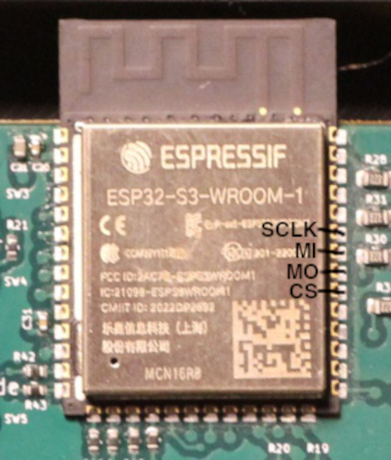

# Appendix: Setting Up Ethernet Support

Experimental support exists for Ethernet on ezDV. In order to enable Ethernet support, some hardware modifications are required 
to be able to attach it to a [W5500 Ethernet module](https://www.amazon.com/dp/B08KXM8TKJ?psc=1&ref=ppx_yo2ov_dt_b_product_details):

1. Remove the main ezDV board from its enclosure and disconnect the battery from the bottom.
2. Solder wires from the positions indicated below on the ESP32 module (near top of board) to their corresponding locations on the W5500 module:

3. Solder power and ground wires from ezDV to the W5500. These can be taken from either J7 (square pin is 3.3V, bottom pin is GND) or from J4/"I2C Breakout" (lower right pin is 3.3V, square pin is GND). Note that J4 is only powered when ezDV is on, while J7 is always powered.

4. Reattach the battery and place ezDV back in its enclosure. You may need to cut out a hole in the enclosure using side cutters or similar to allow the previously-soldered wires to be routed out of the enclosure.

5. Attach an Ethernet cable to the W5500 module and to your router or switch. 

6. Turn on ezDV. If Wi-Fi is already configured, it is recommended to disbale it to prevent network connections from inadvertently going over the wrong interface. Once this is done, restart ezDV.

7. After a few minutes, look for it on the router's list of attached devices after a few minutes. Note its IP for future use. It should now be communicating over Ethernet instead of Wi-Fi.